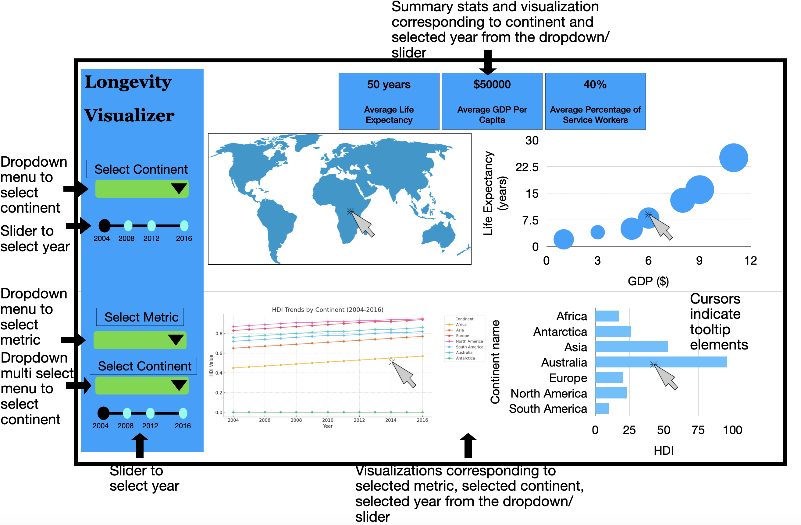

# Longevity Visualizer App Proposal

## 1. Motivation and Purpose

### Our Role

**Data Science Research Team**

### Target Audience

**Researchers in public policy, global development, and sustainability**

Understanding the relationship between health and economic growth is crucial for researchers studying public policy, global development, and sustainability. However, analyzing large-scale data across different regions and years—such as GDP per capita, employment sectors, CO₂ emissions, and health indicators—can be complex and time-consuming. Researchers often require intuitive tools that allow for efficient data exploration and comparison.

To address this need, we propose an **interactive dashboard** that integrates key metrics—**life expectancy, GDP per capita, percentage of service workers, and CO₂ emissions**—to help researchers explore trends, compare regions, and make data-driven decisions.

### Key Features & Benefits

This dashboard will enable users to:

- **Summarize** key health and economic indicators for a selected region and time period.
- **Visualize** trends over time across different regions using interactive maps, bar charts, and scatter plots.
- **Analyze correlations** between life expectancy, GDP per capita, and CO₂ emissions to assess their impact on public health.
- **Compare regions** to identify global disparities and generate policy insights.
- **Explore trade-offs** between economic growth and environmental sustainability.

By providing an **intuitive and interactive visualization platform**, this tool will empower researchers to derive meaningful insights, conduct data-driven analyses, and contribute to **evidence-based policymaking** in health and economic development.

---

## 2. Dataset Description

### Dataset Source

We will use the [Gapminder](https://www.kaggle.com/datasets/albertovidalrod/gapminder-dataset) dataset, which tracks demographic, economic, and health-related metrics across multiple countries over time.

### Dataset Overview

The dataset consists of:

- **3,675** rows (one per country-year combination)
- **8** key columns:

| **Variable** | **Description** |
|-------------|----------------|
| `country` | Name of the country |
| `continent` | Continent of the country |
| `year` | Year of observation (1998-2018) |
| `lifeExp` | Expected lifespan of a newborn under current mortality rates |
| `Hdi_index` | Human Development Index (HDI), ranking countries by development level |
| `Co2_consump` | Carbon dioxide emissions per capita (tonnes) |
| `Gdp` | GDP per capita, adjusted for purchasing power parity (PPP) |
| `Services` | Percentage of employment in the service sector |

**Data Cleaning:**  
Since the dataset contains **a minimal percentage of missing values**, we will remove them to maintain data integrity.

### Why This Dataset?

The Gapminder dataset is widely used to **correct misconceptions** about global health and economic development. Our goal is to help policymakers and public health officials **understand the relationships between economic, demographic, and health indicators**. By exploring the connections among **GDP per capita, population, life expectancy, and CO₂ emissions**, researchers can:

- Identify broad trends in **global development**
- Spot **regional disparities and outliers**
- Design **targeted policies** to improve health and economic conditions

### Variables for Visualization

We will focus on the following **primary variables**:

- **Temporal Data:** `year` (datetime)
- **Geographical Data:** `country`, `continent` (categorical)
- **Health Metrics:** `lifeExp`, `hdi_index`, `health_expenditure` (numeric)
- **Economic Metrics:** `gdpPercap`, `services`, `totalGDP` (numeric)
- **Environmental Impact:** `co2_consump` (numeric)

### Engineered Features

To enrich our analysis, we will create the following **derived variables**:

- **Total GDP (`totalGDP`)** = `population` × `gdpPercap`
  - Captures the overall economic size, providing deeper insights into economic impact beyond per capita income.
- **Health Expenditure (`health_expenditure`)**
  - Sourced from external datasets to assess the relationship between **economic indicators and healthcare investments**.
- **Population (`pop`)**
  - Integrated from additional datasets to calculate **total-scale economic indicators**.

Due to the **manageable dataset size**, no sub-sampling will be necessary.

---

## Section 3: Research questions and usage scenarios

### Target User Persona

| **Name**  | Dr. Olanna Rosling |
|-----------|------------------|
| **Age**  | 42 |
| **Profession**  | Professor of International Health |
| **Location**  | Stockholm, Sweden |
| **Role**  | Senior Researcher, WHO |

Dr. Olanna Rosling is an experienced researcher at the WHO, specializing in the study of global health disparities. They utilize extensive data to [`understand`] the complex factors affecting life expectancy across different regions. Dr. Rosling's primary goal is to [`identify`] key factors that influence life expectancy to guide and improve health policies globally, focusing on low-income regions.

Dr. Rosling logs into the "Longevity Visualizer" and selects Africa to study from 2000 to 2020\. The app displays a color-coded map highlighting life expectancy, where each country's color intensity indicates its life expectancy rate, and bubble size reflects CO2 emissions. Dr. Rosling clicks on Ethiopia due to its surprising data, revealing detailed statistics on life expectancy, GDP, and percentage of service workers. They delve deeper by using the app's tools to [`explore`] these metrics across different countries, focusing on correlations and trends over time. The app facilitates this analysis by displaying interactive charts and graphs that dynamically update based on selected parameters.

Based on the insights gained from the "Longevity Visualizer," Dr. Rosling hypothesizes that efficient healthcare services and economic stability significantly boost life expectancy, even in the presence of low GDP. They prepare a comprehensive report and a presentation for a WHO strategy meeting, proposing specific health and environmental interventions. Dr. Rosling recommends policies focusing on improving healthcare access and pollution control, using Ethiopia and Rwanda as case studies to illustrate successful outcomes. These actions are intended to guide policy adjustments and direct future research efforts aimed at enhancing global health standards.

## Section 4: App Sketch and Brief Description

  

The longevity visualizer contains a landing page that shows various visualizations as well summary statistics. The app is split into two sections.

Starting from the top half, there is a dropdown menu that allows users to select a specific continent and a slider allowing users to select the year. The information conveyed in the visualizations and summary cards will change depending on the selection. The map will allow users to see the life expectancy by country for the selected continent for that specific year. This will be color coded with a higher intensity indicating a higher life expectancy, as well as allowing users to click on the map to see the specific values for life expectancy and the corresponding country. Next to that map, there is a bubble chart of life expectancy vs GDP per capita where the size of the bubbles represents CO2 emissions. You can click on each bubble to see the corresponding CO2 emissions value as well as the country name.

For the bottom half of the app, there’s a drop down menu that allows users to select between HDI, CO2, or life expectancy and compare these values between continents. Continents can be multi-selected for easier comparison. This section includes bar charts based on selected continents and metrics for the corresponding year and line charts corresponding to the selected continents and metrics over time. We also have a slider for the corresponding years for the bar chart.
